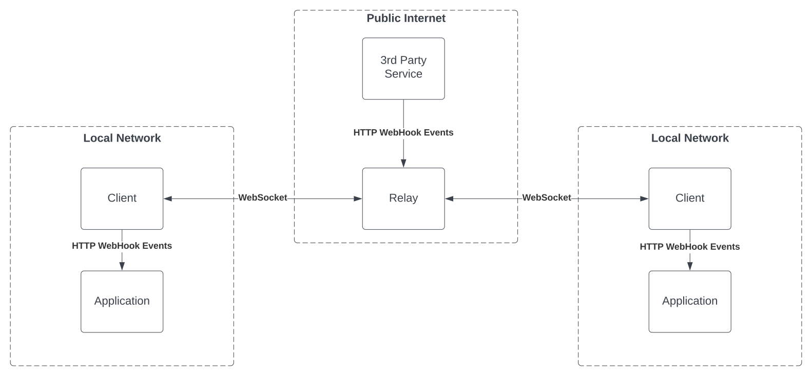

# HookShare


A tool for sharing WebHooks between multiple dev environments.

## Install

Run `npm i -g hookshare`

## The Problem

When building WebHook integration with a 3rd party services, configuring a proxy to forward requests to a local environment, and managing multiple engineers' individual environments simultaneously becomes very cumbersome.

## The Solution

A relay service that is accessible on the public internet that receives WebHook events and forwards them to multiple recipients on private networks.



This is an interesting problem because it is impossible to send multiple responses to one HTTP request. HookShare aims to solve this by being flexible and providing several different options to handle this depending on the use cases.

## Getting started

There is two major components to HookShare, a Relay and a Client.

### Relay

The Relay is accessible from the public internet and receives requests from 3rd parties.

#### Config File

**Example config:**

```json
{
  "routes": {
    "/test": {
      "response": {
        "type": "static",
        "status": 200,
        "body": "{\"status\":\"OK\"}",
        "headers": {
          "content-type": "application/json"
        }
      },
      "forward": {
        "target": "https://localhost",
        "sslVerification": false
      }
    }
  }
}
```

#### Relay Environment Variables

- `HTTP_PORT`: The port to listen on for HTTPS. Defaults to `"8080"`.
- `LOG_LEVEL`: The level of details logged. Defaults to `"warn"`.
- `CONFIG_PATH`: The path to a config file. Defaults to `"config.json"`.
- `BROADCAST_RESPONSE_TIMEOUT_MS`: How long to wait before clients to respond to messages. Defaults to `"5000"`.

#### Relay Startup

Run `hs-relay`

### Client

The Client connects to a target Relay and "replays" any requests received by the Relay.

#### Client Environment Variables

- `RELAY_HOSTNAME`: The full hostname where the Relay server is running. Defaults to `ws://localhost:8080`.

#### Client Startup

Run `hs-client`

### Response Types

#### static

Params

- `type=static`
- `status`: status code for static response
- `body`: body to use for static response
- `headers`: headers to use for static response

When a `static` response is defined in the configuration, the Relay will forward the request details to all connected Clients and respond with the details defined in the configuration.

This can be useful when the response to the WebHook doesn't need to be dynamic.

#### successful-client

Params

- `type=successful-client`
- `expectedStatus`: status code to match for successful response

When a `successful-client` response is defined in the configuration, the Relay will forward the request details to all connected Clients and respond with the details from the first client to respond with a status matching `expectedStatus`. All other client responses will be ignored.

This can be useful when working with on larger teams where each engineer might have their own local datastore. In theory, only the relevant will know about the given resource and thus respond successfully.

#### random-client

Params

- `type=random-client`

When a `random-client` response is defined in the configuration, the Relay will respond with the details returned to one of the clients.

This can be useful when the 3rd party needs a dynamic response from a specific client, and it is unlikely

**coming soon...**

- `dynamic`: write a function to generate a response
- `dynamic-client`: write a function to pick the client response
